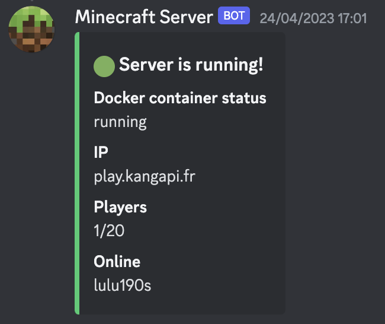
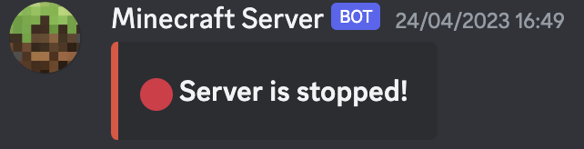

# Screenshots

### `/status` command



### `/stop` command



# How to use

## 1. Clone the repository in your server folder

```bash
git clone https://github.com/kangapi/minecraft-server-discord-bot.git
```

## 2. Install dependencies

```bash
pip install -r requirements.txt
```

## 3. Create a Discord bot

1. Go to [Discord Developer Portal](https://discord.com/developers/applications)
2. Create a new application
3. Go to the "Bot" tab
4. Create a new bot
5. Copy the token and put it in a `.env` file :
    
    ```bash
    TOKEN=your_token
    ```
6. Go to the **OAuth2** tab and url generator
7. Check the **bot** and **application commands** scope
8. Copy the generated URL and paste it in your browser
9. Select the server you want to add the bot to
10. Click on **Authorize**

## 4. Link the bot to your Minecraft server

You just need to put the name of your docker minecraft container in the `.env` file :
    
```bash
DOCKER_CONTAINER_NAME=minecraft
```

## 5. Run the bot

```bash
python3 bot.py
```
